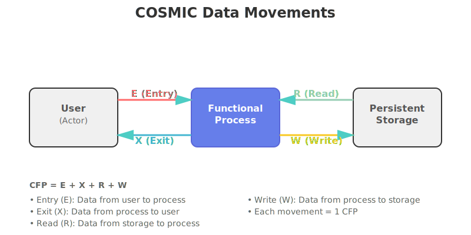

# COSMIC-AI 🚀

[](https://www.python.org/downloads/)
[](https://flask.palletsprojects.com/)
[](https://pytorch.org/)
[](https://huggingface.co/transformers/)
[](LICENSE)

**AI-Powered COSMIC Functional Size Measurement (FSM)**

An automated approach to software size estimation using transformer-based deep learning. COSMIC-AI fine-tunes Microsoft's CodeBERT model to predict COSMIC Function Points (CFP) directly from source code, achieving 96% accuracy on C programs and 88% accuracy on Arduino code compared to expert manual measurements.

---

## 🚦 Quick Start

```bash
# Clone the repository
git clone https://github.com/AhmedEl-Gohary/cosmic-ai.git
cd cosmic-ai

# Install dependencies
pip install torch transformers flask flask-cors pandas numpy scikit-learn

# Start the web application
cd src
python app.py

# Open browser to http://localhost:5000
# Upload your code and analyze!
```

## 📋 Table of Contents

- [Quick Start](#quick-start)
- [Overview](#overview)
- [What is COSMIC FSM?](#what-is-cosmic-fsm)
- [Features](#features)
- [Architecture](#architecture)
- [Technology Stack](#technology-stack)
- [Installation](#installation)
- [Usage](#usage)
- [Model Performance](#model-performance)
- [Validation Results](#validation-results)
- [Project Structure](#project-structure)
- [Research Background](#research-background)
- [FAQ](#faq)
- [Contributing](#contributing)
- [License](#license)
- [Acknowledgments](#acknowledgments)

---

## 🔍 Overview

COSMIC-AI addresses the challenge of time-consuming and error-prone manual COSMIC Functional Size Measurement by automating the process using state-of-the-art AI techniques. The system analyzes source code at the line level and predicts four types of COSMIC data movements:

- **Entry (E)**: Data entering the functional process from a user
- **Exit (X)**: Data leaving the functional process to a user
- **Read (R)**: Data retrieved from persistent storage
- **Write (W)**: Data sent to persistent storage

The total COSMIC Function Points (CFP) equals the sum of all data movements: **CFP = E + X + R + W**

<div align="center">
  
</div>

### Key Highlights

- 🎯 **96% accuracy** on C programs validated against expert measurements
- 🎯 **88% accuracy** on Arduino/IoT code
- 🧠 **R² of 0.887** explaining 88.7% of variance in CFP predictions
- 📊 **MSE of 0.095** for total CFP with MAE of 0.138
- 🌐 **Multi-language support**: C, Arduino, Python, Java, and more
- 🖥️ **Web-based interface** for easy accessibility

---

## 🎓 What is COSMIC FSM?

**COSMIC (Common Software Measurement International Consortium)** is an ISO-standardized second-generation Functional Size Measurement method (ISO/IEC 19761). Unlike earlier methods such as IFPUG or Function Point Analysis, COSMIC:

- Measures software functionality by analyzing **functional processes**
- Focuses on four types of **data movements** (E, X, R, W) instead of transactions
- Is **technology-agnostic** and applicable across diverse domains
- Works for business, real-time, and embedded systems
- Provides accurate sizing for modern architectures (microservices, cloud, IoT)

COSMIC is maintained by the COSMIC Measurement Practices Committee and is widely used for:
- Project effort estimation
- Resource planning
- Software productivity measurement
- Quality assurance and benchmarking

Traditional manual COSMIC measurement is time-intensive and requires expert knowledge. COSMIC-AI automates this process using deep learning.

### COSMIC-AI vs Manual Measurement

| Aspect | Manual COSMIC | COSMIC-AI |
|--------|---------------|-----------|
| **Speed** | Hours to days | Seconds |
| **Expertise Required** | Certified measurer | None |
| **Consistency** | Varies between measurers | Consistent |
| **Cost** | High (expert time) | Low (computational) |
| **Scalability** | Limited | High |
| **Accuracy** | 100% (ground truth) | 88-96% |
| **Best For** | Critical sizing, audits | Development, estimation, CI/CD |

---

## 💡 How It Works

COSMIC-AI uses a fine-tuned CodeBERT transformer model to analyze source code and predict COSMIC data movements. Here's a concrete example:

```c
int getUserData() {                    // E=1 (function entry from user)
    int userInput;                     // W=1 (write to local variable)
    scanf("%d", &userInput);           // E=1, W=1 (entry from user, write to variable)
    
    int storedValue = readDB();        // R=1, W=1 (read from storage, write to variable)
    
    if (userInput > storedValue) {     // R=2 (read both variables)
        writeDB(userInput);            // R=1, X=1 (read variable, exit to storage)
        printf("Updated!\n");          // X=1 (exit message to user)
    }
    
    return userInput;                  // R=1, X=1 (read variable, exit from function)
}
```

**Total CFP for this function**: E(3) + X(4) + R(5) + W(3) = **15 CFP**

The model analyzes each line independently, identifying:
- **Entry (E)**: User inputs, function parameters
- **Exit (X)**: Function returns, output statements  
- **Read (R)**: Variable reads, database queries
- **Write (W)**: Variable assignments, database updates

---

## ✨ Features

### Core Capabilities

- **Automated Line-Level Analysis**: Predicts COSMIC movements for each line of code
- **Multi-Output Regression**: Simultaneously predicts E, X, R, and W values
- **Real-Time Processing**: Fast inference suitable for interactive use
- **Web-Based Interface**: User-friendly GUI with drag-and-drop support
- **Detailed Reports**: Summary statistics and line-by-line breakdowns
- **Export Capabilities**: Results available in CSV and visual formats

### Supported Languages

The model has been trained on and supports:
- C
- Arduino (.ino)
- Python
- Java
- And other common programming languages

### Analysis Features

- **Summary View**: Total lines analyzed, total CFP, average CFP per line, maximum CFP
- **Detailed View**: Line-by-line breakdown showing E, X, R, W counts and total CFP
- **Comment Filtering**: Automatically skips comments and empty lines
- **Error Handling**: Robust processing with informative error messages

---

## 🏗️ Architecture

COSMIC-AI follows a three-tier architecture:

```
┌─────────────────────────────────────────────────────┐
│                   Web Interface                      │
│              (HTML/CSS/JavaScript)                   │
│  - File upload & drag-and-drop                      │
│  - Result visualization                              │
│  - Summary & detailed views                         │
└─────────────────────┬───────────────────────────────┘
                      │
                      │ HTTP/JSON
                      │
┌─────────────────────▼───────────────────────────────┐
│                 Flask Backend                        │
│              (Python REST API)                       │
│  - Request handling                                  │
│  - Code preprocessing                                │
│  - Model inference orchestration                     │
└─────────────────────┬───────────────────────────────┘
                      │
                      │ PyTorch API
                      │
┌─────────────────────▼───────────────────────────────┐
│            CodeBERT Model Layer                      │
│         (Fine-tuned Transformer)                     │
│  - Tokenization                                      │
│  - Encoder: 12-layer transformer                     │
│  - Regression head: 4-output (E, X, R, W)          │
└─────────────────────────────────────────────────────┘
```

### Model Architecture Deep Dive

<div align="center">
  
</div>

The model architecture consists of:
- **Input Layer**: Accepts source code lines as text
- **Tokenizer**: Converts code to token IDs using CodeBERT vocabulary
- **Embedding Layer**: Creates 768-dimensional embeddings with positional encoding
- **Transformer Encoder**: 12-layer bidirectional transformer with self-attention
- **Pooling**: Extracts [CLS] token representation
- **Regression Head**: Linear layer producing 4 continuous outputs (E, X, R, W)

### Processing Pipeline

1. **Input**: User uploads source code file through web interface
2. **Preprocessing**: Backend filters comments and empty lines
3. **Tokenization**: CodeBERT tokenizer converts code to token IDs
4. **Prediction**: Fine-tuned model predicts E, X, R, W for each line
5. **Aggregation**: Calculate total CFP and summary statistics
6. **Output**: Display results in summary and detailed views

<div align="center">
  
</div>

---

## 🛠️ Technology Stack

### Machine Learning & AI

- **[CodeBERT](https://github.com/microsoft/CodeBERT)**: Pre-trained transformer model for code understanding
- **[PyTorch](https://pytorch.org/)**: Deep learning framework
- **[Hugging Face Transformers](https://huggingface.co/transformers/)**: Model architecture and utilities

### Backend

- **[Flask](https://flask.palletsprojects.com/)**: Lightweight web framework
- **[Flask-CORS](https://flask-cors.readthedocs.io/)**: Cross-origin resource sharing support
- **Python 3.8+**: Core programming language

### Frontend

- **HTML5/CSS3**: Modern web interface
- **JavaScript (Vanilla)**: Interactive functionality
- **Responsive Design**: Mobile-friendly layout

### Data Science

- **[pandas](https://pandas.pydata.org/)**: Dataset manipulation
- **[NumPy](https://numpy.org/)**: Numerical operations
- **[scikit-learn](https://scikit-learn.org/)**: Evaluation metrics

---

## 📦 Installation

### Prerequisites

- Python 3.8 or higher
- pip (Python package manager)
- 4GB+ RAM (for model inference)
- CUDA-compatible GPU (optional, for faster inference)

### Step 1: Clone the Repository

```bash
git clone https://github.com/AhmedEl-Gohary/cosmic-ai.git
cd cosmic-ai
```

### Step 2: Install Dependencies

```bash
pip install torch torchvision torchaudio
pip install transformers
pip install flask flask-cors
pip install pandas numpy scikit-learn scipy
pip install datasets
```

Or create a requirements file:

```bash
# requirements.txt
torch>=2.0.0
transformers>=4.30.0
flask>=2.0.0
flask-cors>=4.0.0
pandas>=1.5.0
numpy>=1.23.0
scikit-learn>=1.2.0
scipy>=1.10.0
datasets>=2.12.0
```

Then install:
```bash
pip install -r requirements.txt
```

### Step 3: Download Pre-trained Model

The fine-tuned CodeBERT model should be placed in the `codebert-cfp/best-model` directory. If you need to train your own model, see the [Model Training](#model-training) section.

---

## 🚀 Usage

### Web Application

#### Start the Server

```bash
cd src
python app.py
```

The application will start on `http://localhost:5000` by default.

#### Using the Interface

1. **Open Browser**: Navigate to `http://localhost:5000`
2. **Upload Code**: Click or drag-and-drop a source code file
3. **Analyze**: Click "Analyze COSMIC CFP" button
4. **View Results**: 
   - **Summary View**: See total CFP, average CFP, and other statistics
   - **Detailed View**: Examine line-by-line COSMIC measurements

#### Example Analysis

Input code:
```c
int sum(int x, int y) {
    int z = 0;
    z = x + y;
    return z;
}
```

Output:
```
Line 1: int sum(int x, int y) {     E=2, X=1, R=0, W=0 → CFP=3
Line 2: int z = 0;                  E=0, X=0, R=0, W=1 → CFP=1
Line 3: z = x + y;                  E=0, X=0, R=1, W=1 → CFP=2
Line 4: return z;                   E=0, X=0, R=1, W=0 → CFP=1

Total CFP: 7
Average CFP per line: 1.75
```

### Command-Line Tools

#### Standalone CFP Prediction

```bash
cd src
python calculate_cfp.py -f path/to/your/code.c
```

Or use stdin:
```bash
python calculate_cfp.py < path/to/your/code.c
```

#### Arduino/C Automated Analyzer

For C or Arduino files with rule-based analysis:

```bash
cd src
python arduino_cfp.py path/to/code.ino
```

Or for C files:
```bash
python c_cfp.py path/to/code.c
```

#### COSMIC Analyzer (Combined Tool)

```bash
cd src
python cosmic_analyzer.py path/to/code.c
```

This tool:
- Analyzes C or Arduino files
- Saves results to `cosmic_dataset.csv`
- Displays a formatted report with E, X, R, W counts

### Model Training

If you want to train your own model or fine-tune with additional data:

#### Step 1: Prepare Dataset

Create or expand `cosmic_dataset.csv` with the following format:

```csv
code,E,X,R,W,CFP
"int sum(int x, int y) {",2,1,0,0,3
"int z = 0;",0,0,0,1,1
"z = x + y;",0,0,1,1,2
"return z;",0,0,1,0,1
```

#### Step 2: Run Fine-Tuning

```bash
cd src
python finetune.py
```

The script will:
- Load the dataset from `cosmic_dataset.csv`
- Split it 80/20 for training/testing
- Fine-tune CodeBERT for 5 epochs
- Save the best model to `codebert-cfp/best-model`
- Display evaluation metrics

#### Step 3: Model Output

After training, you'll see metrics for each COSMIC movement (E, X, R, W) and total CFP:
- Mean Squared Error (MSE)
- Root Mean Squared Error (RMSE)
- Mean Absolute Error (MAE)
- R² Score
- Pearson Correlation

---

## 📊 Model Performance

### Test Set Evaluation Metrics

The CodeBERT model was fine-tuned for 5 epochs with batch size 8, optimizing for minimum Mean Squared Error on total CFP.

<div align="center">
  
</div>

| Metric | Entry (E) | Exit (X) | Read (R) | Write (W) | **Total CFP** |
|--------|-----------|----------|----------|-----------|---------------|
| **MSE** | 0.019 | 0.012 | 0.029 | 0.019 | **0.095** |
| **RMSE** | 0.138 | 0.110 | 0.171 | 0.140 | **0.309** |
| **MAE** | 0.034 | 0.048 | 0.069 | 0.056 | **0.138** |
| **R²** | 0.866 | 0.915 | 0.917 | 0.895 | **0.887** |

### Key Insights

- **R² = 0.887**: The model explains 88.7% of variance in CFP predictions
- **MAE = 0.138**: Average absolute error is less than 0.14 function points
- **RMSE = 0.309**: Typical prediction deviation is ~0.31 CFP
- **Practical Accuracy**: Since CFP values are rounded to integers, errors < 0.5 result in correct final values for most predictions

### Training Configuration

- **Base Model**: microsoft/codebert-base
- **Architecture**: 12-layer transformer with regression head
- **Output Dimensions**: 4 (E, X, R, W)
- **Training Epochs**: 5
- **Batch Size**: 8
- **Learning Rate**: 5e-5
- **Optimization Target**: Minimum MSE for total CFP
- **Dataset Split**: 80% training, 20% testing
- **Inference Speed**: ~65 samples/second

---

## ✅ Validation Results

The model was validated against published expert COSMIC measurements from peer-reviewed research papers.

### Case Study 1: C Program (Koulla et al., 2022)

**Source**: Koulla, M., Šteinberga, L., & Kampars, J. (2022) - C program with comprehensive manual COSMIC measurement by three independent evaluators including one certified COSMIC measurer.

| Metric | Value |
|--------|-------|
| Expert Manual Measurement | 45 CFP |
| COSMIC-AI Prediction | 43 CFP |
| **Accuracy** | **96%** |
| Deviation | 2 function points |

**Key Insight**: The automated system achieved near-perfect alignment with expert consensus measurement on complex C code.

### Case Study 2: Arduino IoT Application (Soubra & Abran, 2017)

**Source**: Soubra, H., & Abran, A. (2017) - Internet of Things application using Arduino open-source platform.

| Metric | Value |
|--------|-------|
| Expert Manual Measurement | 17 CFP |
| COSMIC-AI Prediction | 15 CFP |
| **Accuracy** | **88%** |
| Deviation | 2 function points |

**Key Insight**: Strong performance on embedded systems code with hardware interactions, demonstrating robustness across different programming paradigms.

### Performance Analysis

The validation demonstrates:
- Consistent performance across different code types (traditional C and embedded IoT)
- Close alignment with expert human measurement
- Practical utility for real-world software sizing applications
- Strong generalization despite different programming contexts

---

## 📁 Project Structure

```
cosmic-ai/
├── Paper/
│   └── Ahmed_El_Gohary_Bachelor_Thesis.pdf    # Full research thesis (59 pages)
├── src/
│   ├── app.py                    # Flask web application backend
│   ├── calculate_cfp.py          # Standalone CFP prediction CLI
│   ├── arduino_cfp.py            # Arduino-specific analyzer
│   ├── c_cfp.py                  # C-specific analyzer
│   ├── cosmic_analyzer.py        # Combined analyzer tool
│   └── finetune.py               # Model fine-tuning script
├── templates/
│   └── index.html                # Web interface UI
├── test/
│   ├── code.c                    # Sample C code
│   ├── code.ino                  # Sample Arduino code
│   └── cosmic_dataset.csv        # Training dataset
├── codebert-cfp/
│   └── best-model/               # Fine-tuned CodeBERT model (not in repo)
└── README.md                     # This file
```

### Key Files Explained

- **`app.py`**: Main Flask application serving the web interface and REST API endpoints
- **`finetune.py`**: Script for fine-tuning CodeBERT on COSMIC dataset
- **`calculate_cfp.py`**: Command-line tool for predicting CFP from code files or stdin
- **`cosmic_analyzer.py`**: Comprehensive analyzer supporting C and Arduino with CSV export
- **`cosmic_dataset.csv`**: Training dataset with columns: code, E, X, R, W, CFP

---

## 🔬 Research Background

This project is based on a Bachelor's thesis titled **"AI-Powered COSMIC Functional Size Measurement (FSM)"** by Ahmed Mohamed El-Gohary, supervised by Dr. Milad Ghantous and Dr. Hassan Soubra at the German University in Cairo (May 2025).

### Research Contributions

1. **Novel Approach**: First application of CodeBERT for line-level COSMIC FSM prediction
2. **Multi-Language Dataset**: Comprehensive dataset covering C, Arduino, Python, and Java
3. **Strong Performance**: Achieved R² of 0.887 with MSE of 0.095 on test set
4. **Validated Accuracy**: 96% accuracy on C programs, 88% on Arduino code vs. expert measurements
5. **Practical Tool**: COSMIC-AI web application for accessible automated measurement

### Dataset Composition

The training dataset includes:
- **C programs**: System-level and algorithmic code
- **Arduino code**: IoT and embedded systems applications
- **Python programs**: Various application domains
- **Java programs**: Object-oriented software

Each line is annotated with Entry (E), Exit (X), Read (R), and Write (W) values following COSMIC ISO 19761 standards.

### Model Training

The CodeBERT model was fine-tuned using:
- **Pre-trained base**: microsoft/codebert-base (trained on 6 programming languages)
- **Fine-tuning objective**: Multi-output regression for E, X, R, W prediction
- **Loss function**: Mean Squared Error (MSE)
- **Optimization**: AdamW optimizer with learning rate 5e-5
- **Regularization**: Dynamic padding, truncation to 512 tokens

---

## ❓ FAQ

### What programming languages does COSMIC-AI support?

COSMIC-AI has been trained on C, Arduino, Python, and Java code. However, the CodeBERT base model was pre-trained on 6 languages (Python, Java, JavaScript, PHP, Ruby, Go), so it may generalize reasonably to other languages with similar syntax.

### How accurate is the automated measurement?

The model achieves:
- 96% accuracy on C programs (validated against expert measurements)
- 88% accuracy on Arduino/IoT code
- R² of 0.887, explaining 88.7% of variance in CFP predictions
- Average error of only 0.138 CFP per line

### Do I need a GPU to run COSMIC-AI?

No, a GPU is optional. The model runs efficiently on CPU (approximately 65 samples/second). A GPU will provide faster inference but is not required for typical use cases.

### Can I use COSMIC-AI for commercial projects?

Yes, COSMIC-AI is released under the MIT License, which permits commercial use. However, please review the license terms and provide appropriate attribution.

### How does this compare to manual COSMIC measurement?

Manual COSMIC measurement by experts typically takes several hours for complex programs and requires specialized training. COSMIC-AI provides instant results with accuracy comparable to expert consensus, making it ideal for:
- Quick estimation during development
- Continuous integration pipelines
- Large-scale codebase analysis
- Educational purposes

### What's the maximum code size COSMIC-AI can analyze?

Individual lines are limited to 512 tokens (the model's maximum input length). Files of any size can be analyzed line-by-line. For very long lines, the tokenizer automatically truncates, which may affect accuracy on those specific lines.

### Can I fine-tune the model on my own data?

Yes! The repository includes `finetune.py` for training on your own annotated dataset. Simply prepare your data in CSV format with columns: code, E, X, R, W, CFP.

### Why are my predictions different from manual measurements?

Minor differences are expected because:
1. The model learns patterns from training data, which may differ from specific COSMIC interpretations
2. Edge cases or uncommon code patterns may not be well-represented in training data
3. Manual measurements can also vary between different expert measurers

For critical applications, we recommend using COSMIC-AI as a first-pass tool and having experts review the results.

---

## 🤝 Contributing

Contributions are welcome! Here's how you can help:

### Areas for Contribution

1. **Dataset Expansion**: Add more annotated code samples in various languages
2. **Model Improvements**: Experiment with different architectures or hyperparameters
3. **Language Support**: Extend support to additional programming languages
4. **UI Enhancements**: Improve the web interface design and functionality
5. **Testing**: Add unit tests and integration tests
6. **Documentation**: Improve code comments and user guides

### Getting Started

1. Fork the repository
2. Create a feature branch: `git checkout -b feature/your-feature-name`
3. Make your changes and commit: `git commit -am 'Add some feature'`
4. Push to the branch: `git push origin feature/your-feature-name`
5. Submit a pull request

### Code Style

- Follow PEP 8 for Python code
- Add docstrings to functions and classes
- Include comments for complex logic
- Test your changes before submitting

---

## 📄 License

This project is licensed under the MIT License - see the [LICENSE](LICENSE) file for details.

---

## 🙏 Acknowledgments

### Supervisors

- **Dr. Milad Ghantous** - Guidance and support throughout the research
- **Dr. Hassan Soubra** - Expert insights on COSMIC FSM methodology

### Institution

- **German University in Cairo** - Media Engineering and Technology Faculty

### Technologies

- **Microsoft Research** - CodeBERT pre-trained model
- **Hugging Face** - Transformers library and model hosting
- **COSMIC** - Measurement Practices Committee for COSMIC ISO 19761 standard

### Research References

This work builds upon:
- Koulla et al. (2022) - C program COSMIC measurement validation
- Soubra & Abran (2017) - Arduino IoT COSMIC measurement
- Tenekeci et al. (2023) - CodeBERT application to FSM
- COSMIC Measurement Manual v5.0 (ISO/IEC 19761)

### About the Author

**Ahmed Mohamed El-Gohary** is a graduate of the Media Engineering and Technology Faculty at the German University in Cairo. This project represents his Bachelor's thesis work in applying state-of-the-art AI techniques to software engineering challenges.

**Academic Background**:
- Bachelor's Degree in Media Engineering and Technology
- Focus areas: Machine Learning, Software Engineering, Natural Language Processing
- Research interests: AI-powered software analysis and measurement

**Supervisors**:
- Dr. Milad Ghantous - Primary supervisor
- Dr. Hassan Soubra - Co-supervisor and COSMIC FSM expert

---

## 📚 Further Reading

- [COSMIC Measurement Manual](https://cosmic-sizing.org/)
- [CodeBERT Paper](https://arxiv.org/abs/2002.08155)
- [Full Bachelor Thesis](Paper/Ahmed_El_Gohary_Bachelor_Thesis.pdf) (included in repository)

---

## 📧 Contact

For questions, suggestions, or collaboration opportunities:

- **Author**: Ahmed Mohamed El-Gohary
- **Institution**: German University in Cairo
- **Repository**: [github.com/AhmedEl-Gohary/cosmic-ai](https://github.com/AhmedEl-Gohary/cosmic-ai)

---

<div align="center">

**COSMIC-AI** - Bringing AI-powered automation to software size measurement 🚀

Made with ❤️ at the German University in Cairo

</div>